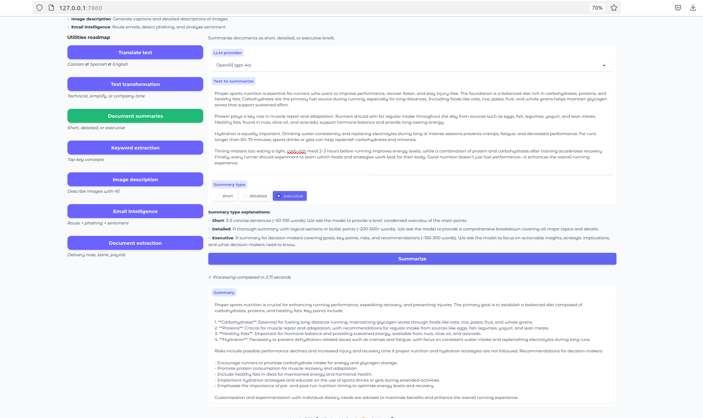
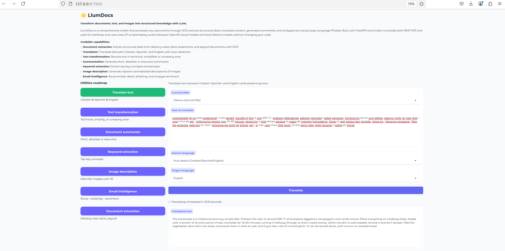
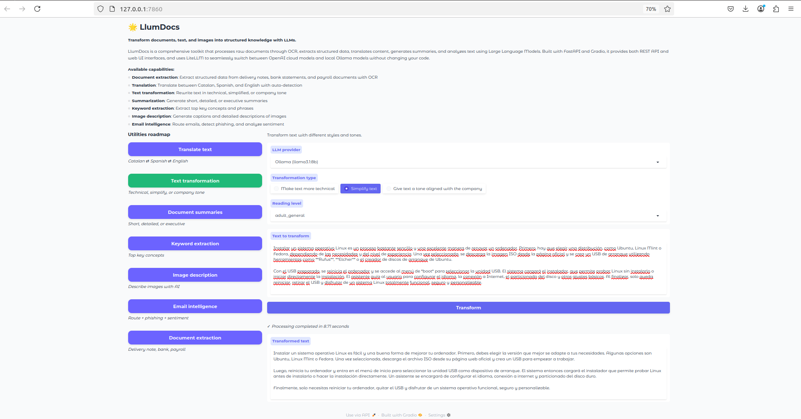
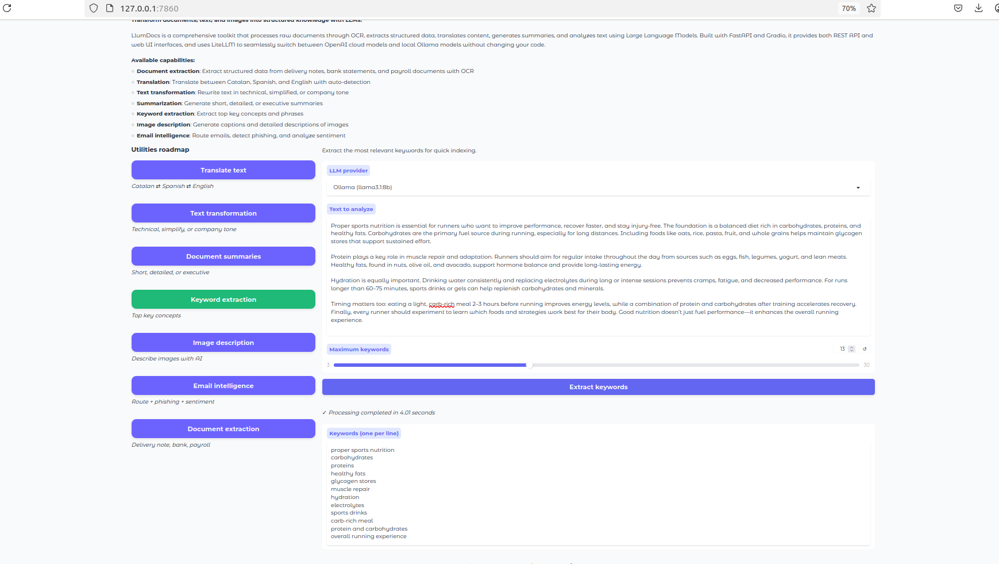
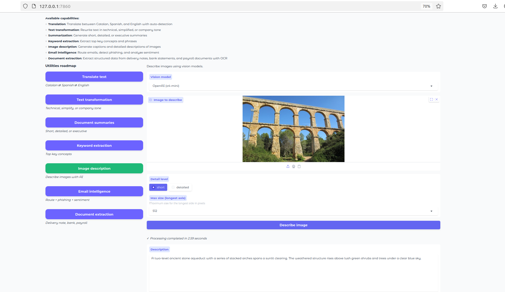
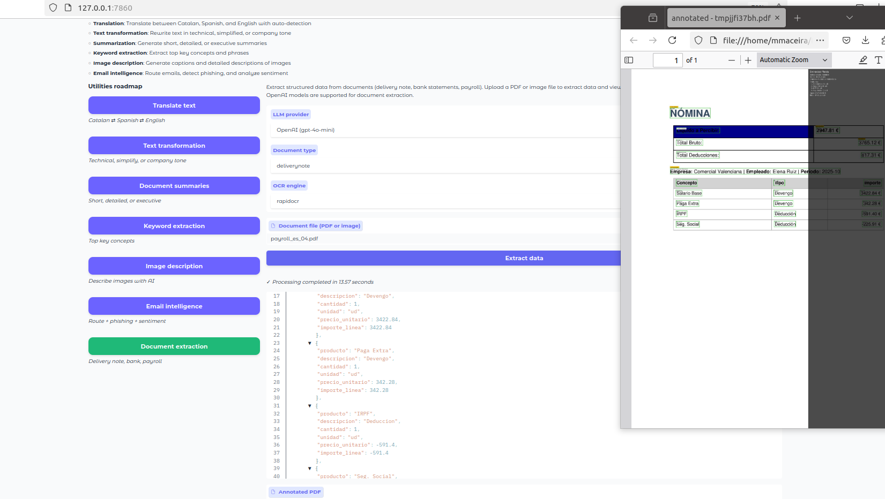
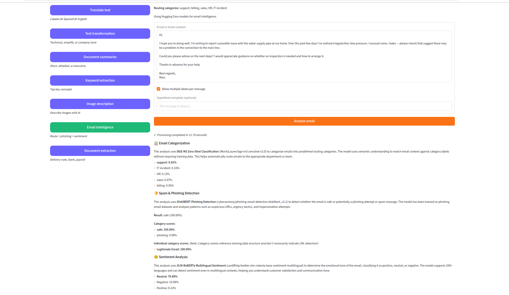

## LlumDocs interface at a glance

This guide walks through the main LlumDocs screens so you can quickly see where to find each capability and how it behaves.

---

### Document summaries

- **What you see**: a text area or file uploader, a choice of summary style, and a results panel.
- **What it does**: turns long documents into short, readable summaries.
- **When to use it**: to brief yourself or others on contracts, reports, specifications, or long emails without reading everything line by line.

---

### Text translation

- **What you see**: a text box, language selectors, and a translate button.
- **What it does**: translates between Catalan, Spanish, and English, with optional automatic detection of the original language.
- **When to use it**: to share information across teams and customers in different languages while keeping tone and meaning.

---

### Text transformation

- **What you see**: a text box, options for plain language, technical tone, or company tone, and a generate button.
- **What it does**: rewrites your text to match the audience and style you need.
- **When to use it**:
  - To simplify complex explanations for non‑experts.
  - To make content more precise and formal for reports or proposals.
  - To convert rough notes into complete, professional emails.

---

### Keyword extraction

- **What you see**: a text area, a control for how many keywords you want, and a list of results.
- **What it does**: identifies the main terms and concepts in a piece of text.
- **When to use it**: to tag documents, create quick indexes, or scan a topic at a glance.

---

### Image description

- **What you see**: an image upload area, an option for description detail, and a result panel.
- **What it does**: generates natural‑language descriptions of images, scanned pages, or screenshots.
- **When to use it**: to add captions, improve accessibility text, or understand images that contain important information.

---

### Document extraction

- **What you see**: a file upload, a selector for the type of document, and a structured output view.
- **What it does**: reads delivery notes, bank statements, and payroll documents and extracts key fields into a structured format.
- **When to use it**: to speed up back‑office work such as reconciliation, reporting, or checking payroll details.

---

### Email intelligence

- **What you see**: a text area for pasting email content and a panel showing routing suggestions, phishing risk, and sentiment.
- **What it does**: helps you decide where an email should go, whether it looks suspicious, and what overall tone it has.
- **When to use it**:
  - To triage shared inboxes and ticket queues.
  - To highlight potentially risky messages.
  - To understand how a customer is feeling before you reply.
